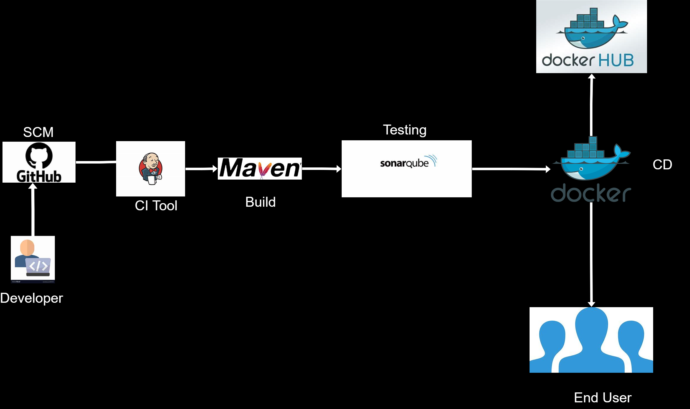

# CICD Engineering assessment

# Tools used
1. jenkins
2. docker
3. sonarqube
4. Maven


# A visual representation of the solution 



# steps
1. spin up an instances in AWS
2. connect via ssh
3. configure the instance
4. installation of jenkins
5. installation of sonaqube
6. installation of maven
7. installation of docker


# Installing Jenkins
Add Jenkins Repository Key

    wget -q -O - https://pkg.jenkins.io/debian/jenkins.io.key | sudo apt-key add -
    
Add Jenkins Repository

    sudo sh -c 'echo deb https://pkg.jenkins.io/debian-stable binary/ > /etc/apt/sources.list.d/jenkins.list'
    
Update Package Lists

    sudo apt update
    
Install Jenkins

    sudo apt install jenkins
    
Start and Enable Jenkins

    sudo systemctl start jenkins
    sudo systemctl enable jenkins
    
# connect to jenkins
open a web browser and go to http://localhost:8080 or http://your_server_ip:8080.

You will be prompted to enter the initial admin password. Retrieve it with:


    sudo cat /var/lib/jenkins/secrets/initialAdminPassword


install the required plugins - maven Docker, sonaqube scanner
and add the necessary credentials


# installation of docker
Update the Package Lists

    sudo apt update
    
Install Docker

    sudo apt install docker.io
    
Start and Enable Docker


    sudo systemctl start docker
    sudo systemctl enable docker
    
Verify Docker Installation

    docker --version

# run sonarqube as a container because the installation process is complex

    docker run -d --name sonarqube -p 9000:9000 -p 9092:9092 sonarqube
# connect to sonarqube
open a web browser and go to http://localhost:9000 or http://your_server_ip:9000

## CICD Pipeline
CI/CD stands for Continuous Integration and Continuous Deployment (or Continuous Delivery). It's a set of best practices, principles, and automated tools used in software development to ensure that code changes are tested and deployed efficiently and reliably.

Here's a brief overview of CI/CD:

Continuous Integration (CI):

Integration: Developers regularly merge their code changes into a shared repository (version control system like Git).
Automated Testing: Automated tests are run to validate that the new code doesn't break existing functionality.
Early Detection of Issues: CI helps catch and fix integration issues early in the development process.
Continuous Deployment (CD):

Deployment Automation: Once code changes pass the CI phase, they are automatically deployed to production or staging environments.
Release Management: This can include processes for managing versioning, release notes, and rollback strategies.
Continuous Delivery (CD):

Similar to Continuous Deployment: The main difference is that with Continuous Delivery, code changes are automatically deployed to staging or pre-production environments, but deployment to production is done manually.
Benefits:

Faster Development: It reduces the time it takes to get new features to users.
Reliability: Automated testing and deployments reduce the chances of human error.
Consistency: Environments are consistent, reducing the "it works on my machine" problem.
Feedback Loop: Developers get fast feedback on the impact of their changes.
Tools:

Version Control Systems (e.g., Git): These are at the heart of CI/CD. They enable collaboration and version management.
CI Servers (e.g., Jenkins, GitLab CI, Travis CI): These automate the process of integration and testing.
Deployment and Orchestration Tools (e.g., Kubernetes, Docker): These manage the deployment of applications.
Configuration Management Tools (e.g., Ansible, Puppet, Chef): They help automate the setup and configuration of environments.
Pipeline:

A CI/CD pipeline is a series of automated steps that code changes go through from development to deployment. It typically includes steps like building, testing, and deploying the code.
Deployment Strategies:

Blue-Green Deployment: A new version is deployed alongside the old version. Traffic is switched from the old to the new version.
Canary Release: A small percentage of traffic is directed to the new version to ensure it's stable before full deployment.
Rolling Deployment: New versions are gradually deployed across servers or clusters, minimizing downtime.
CI/CD is crucial in modern software development as it helps teams deliver high-quality code more efficiently and with fewer errors. It's an integral part of DevOps practices, promoting collaboration between development and operations teams.


## CICD process
Jenkins was used to setup the CICD pipeline using pipeline as code method (groovy), also jenkins shared library was also intergrated to make the code flexible and re-useable [Jekins Shared Library repo link (https://github.com/Hybeekay1/Jenkins_Shared_Library.git)

# jenkins pipelin code

bash```
@Library('my-shared-library') _
pipeline {
   agent any
   parameters{
        choice(name: 'action', choices: 'create\ndelete', description: 'Choose create/Destroy')
        string(name: 'ImageName', description: "name of the docker image", defaultValue: 'pet-clinic')
        string(name: 'HubUser', description: "Docker Hub user", defaultValue: 'malik0x')
   }
   stages {
    stage('Git Checkout'){
    when { expression {  params.action == 'create' } }
      steps {
         gitCheckout(
            branch: "main",
            url: "https://github.com/Hybeekay1/SpringPet-Clinic.git"
         )
            }
        }
      stage('Maven Build'){
      when { expression {  params.action == 'create' } }
      steps {
         mvnBuild()
            }
        }
      stage('Testing'){
      when { expression {  params.action == 'create' } }
      steps {
         script {
            def SonarQubecredentialsId = 'sonarqube-api'
            codeTest(SonarQubecredentialsId)
               }
            }
        }
      stage('Docker Build'){
      when { expression {  params.action == 'create' } }
      steps {
         script {
            dockerBuild("${params.ImageName}","${params.HubUser}")
               }
            }
        }
      stage('Docker Push To Docker Hub'){
      when { expression {  params.action == 'create' } }
      steps {
         script {
            dockerImagePush("${params.ImageName}","${params.HubUser}")
               }
            }
        }
      stage('App Deploy'){
      when { expression {  params.action == 'create' } }
      steps {
         script {
            deployApp("${params.ImageName}","${params.HubUser}")
               }
            }
        }
    }
}
bash```

# Spring PetClinic Sample Application [](https://github.com/spring-projects/spring-petclinic/actions/workflows/maven-build.yml)

[](https://gitpod.io/#https://github.com/spring-projects/spring-petclinic) [](https://github.com/codespaces/new?hide_repo_select=true&ref=main&repo=7517918)


## Understanding the Spring Petclinic application with a few diagrams
<a href="https://speakerdeck.com/michaelisvy/spring-petclinic-sample-application">See the presentation here</a>

## Running petclinic locally
Petclinic is a [Spring Boot](https://spring.io/guides/gs/spring-boot) application built using [Maven](https://spring.io/guides/gs/maven/) or [Gradle](https://spring.io/guides/gs/gradle/). You can build a jar file and run it from the command line (it should work just as well with Java 17 or newer):


```
git clone https://github.com/spring-projects/spring-petclinic.git
cd spring-petclinic
./mvnw package
java -jar target/*.jar
```

You can then access petclinic at http://localhost:8080/


Or you can run it from Maven directly using the Spring Boot Maven plugin. If you do this, it will pick up changes that you make in the project immediately (changes to Java source files require a compile as well - most people use an IDE for this):

```
./mvnw spring-boot:run
```

> NOTE: If you prefer to use Gradle, you can build the app using `./gradlew build` and look for the jar file in `build/libs`.

## Building a Container

There is no `Dockerfile` in this project. You can build a container image (if you have a docker daemon) using the Spring Boot build plugin:

```
./mvnw spring-boot:build-image
```

## In case you find a bug/suggested improvement for Spring Petclinic
Our issue tracker is available [here](https://github.com/spring-projects/spring-petclinic/issues)


## Database configuration

In its default configuration, Petclinic uses an in-memory database (H2) which
gets populated at startup with data. The h2 console is exposed at `http://localhost:8080/h2-console`,
and it is possible to inspect the content of the database using the `jdbc:h2:mem:testdb` url.
 
A similar setup is provided for MySQL and PostgreSQL if a persistent database configuration is needed. Note that whenever the database type changes, the app needs to run with a different profile: `spring.profiles.active=mysql` for MySQL or `spring.profiles.active=postgres` for PostgreSQL.

You can start MySQL or PostgreSQL locally with whatever installer works for your OS or use docker:

```
docker run -e MYSQL_USER=petclinic -e MYSQL_PASSWORD=petclinic -e MYSQL_ROOT_PASSWORD=root -e MYSQL_DATABASE=petclinic -p 3306:3306 mysql:8.0
```

or

```
docker run -e POSTGRES_USER=petclinic -e POSTGRES_PASSWORD=petclinic -e POSTGRES_DB=petclinic -p 5432:5432 postgres:15.2
```

Further documentation is provided for [MySQL](https://github.com/spring-projects/spring-petclinic/blob/main/src/main/resources/db/mysql/petclinic_db_setup_mysql.txt)
and for [PostgreSQL](https://github.com/spring-projects/spring-petclinic/blob/main/src/main/resources/db/postgres/petclinic_db_setup_postgres.txt).

Instead of vanilla `docker` you can also use the provided `docker-compose.yml` file to start the database containers. Each one has a profile just like the Spring profile:

```
$ docker-compose --profile mysql up
```

or

```
$ docker-compose --profile postgres up
```

## Test Applications

At development time we recommend you use the test applications set up as `main()` methods in `PetClinicIntegrationTests` (using the default H2 database and also adding Spring Boot devtools), `MySqlTestApplication` and `PostgresIntegrationTests`. These are set up so that you can run the apps in your IDE and get fast feedback, and also run the same classes as integration tests against the respective database. The MySql integration tests use Testcontainers to start the database in a Docker container, and the Postgres tests use Docker Compose to do the same thing.

## Compiling the CSS

There is a `petclinic.css` in `src/main/resources/static/resources/css`. It was generated from the `petclinic.scss` source, combined with the [Bootstrap](https://getbootstrap.com/) library. If you make changes to the `scss`, or upgrade Bootstrap, you will need to re-compile the CSS resources using the Maven profile "css", i.e. `./mvnw package -P css`. There is no build profile for Gradle to compile the CSS.

## Working with Petclinic in your IDE

### Prerequisites
The following items should be installed in your system:
* Java 17 or newer (full JDK, not a JRE).
* [git command line tool](https://help.github.com/articles/set-up-git)
* Your preferred IDE 
  * Eclipse with the m2e plugin. Note: when m2e is available, there is an m2 icon in `Help -> About` dialog. If m2e is
  not there, follow the install process [here](https://www.eclipse.org/m2e/)
  * [Spring Tools Suite](https://spring.io/tools) (STS)
  * [IntelliJ IDEA](https://www.jetbrains.com/idea/)
  * [VS Code](https://code.visualstudio.com)

### Steps:

1) On the command line run:
    ```
    git clone https://github.com/spring-projects/spring-petclinic.git
    ```
2) Inside Eclipse or STS:
    ```
    File -> Import -> Maven -> Existing Maven project
    ```

    Then either build on the command line `./mvnw generate-resources` or use the Eclipse launcher (right click on project and `Run As -> Maven install`) to generate the css. Run the application main method by right-clicking on it and choosing `Run As -> Java Application`.

3) Inside IntelliJ IDEA
    In the main menu, choose `File -> Open` and select the Petclinic [pom.xml](pom.xml). Click on the `Open` button.

    CSS files are generated from the Maven build. You can build them on the command line `./mvnw generate-resources` or right-click on the `spring-petclinic` project then `Maven -> Generates sources and Update Folders`.

    A run configuration named `PetClinicApplication` should have been created for you if you're using a recent Ultimate version. Otherwise, run the application by right-clicking on the `PetClinicApplication` main class and choosing `Run 'PetClinicApplication'`.

4) Navigate to Petclinic

    Visit [http://localhost:8080](http://localhost:8080) in your browser.


## Looking for something in particular?

|Spring Boot Configuration | Class or Java property files  |
|--------------------------|---|
|The Main Class | [PetClinicApplication](https://github.com/spring-projects/spring-petclinic/blob/main/src/main/java/org/springframework/samples/petclinic/PetClinicApplication.java) |
|Properties Files | [application.properties](https://github.com/spring-projects/spring-petclinic/blob/main/src/main/resources) |
|Caching | [CacheConfiguration](https://github.com/spring-projects/spring-petclinic/blob/main/src/main/java/org/springframework/samples/petclinic/system/CacheConfiguration.java) |

## Interesting Spring Petclinic branches and forks

The Spring Petclinic "main" branch in the [spring-projects](https://github.com/spring-projects/spring-petclinic)
GitHub org is the "canonical" implementation based on Spring Boot and Thymeleaf. There are
[quite a few forks](https://spring-petclinic.github.io/docs/forks.html) in the GitHub org
[spring-petclinic](https://github.com/spring-petclinic). If you are interested in using a different technology stack to implement the Pet Clinic, please join the community there.


## Interaction with other open source projects

One of the best parts about working on the Spring Petclinic application is that we have the opportunity to work in direct contact with many Open Source projects. We found bugs/suggested improvements on various topics such as Spring, Spring Data, Bean Validation and even Eclipse! In many cases, they've been fixed/implemented in just a few days.
Here is a list of them:

| Name | Issue |
|------|-------|
| Spring JDBC: simplify usage of NamedParameterJdbcTemplate | [SPR-10256](https://jira.springsource.org/browse/SPR-10256) and [SPR-10257](https://jira.springsource.org/browse/SPR-10257) |
| Bean Validation / Hibernate Validator: simplify Maven dependencies and backward compatibility |[HV-790](https://hibernate.atlassian.net/browse/HV-790) and [HV-792](https://hibernate.atlassian.net/browse/HV-792) |
| Spring Data: provide more flexibility when working with JPQL queries | [DATAJPA-292](https://jira.springsource.org/browse/DATAJPA-292) |


# Contributing

The [issue tracker](https://github.com/spring-projects/spring-petclinic/issues) is the preferred channel for bug reports, features requests and submitting pull requests.

For pull requests, editor preferences are available in the [editor config](.editorconfig) for easy use in common text editors. Read more and download plugins at <https://editorconfig.org>. If you have not previously done so, please fill out and submit the [Contributor License Agreement](https://cla.pivotal.io/sign/spring).

# License

The Spring PetClinic sample application is released under version 2.0 of the [Apache License](https://www.apache.org/licenses/LICENSE-2.0).

[spring-petclinic]: https://github.com/spring-projects/spring-petclinic
[spring-framework-petclinic]: https://github.com/spring-petclinic/spring-framework-petclinic
[spring-petclinic-angularjs]: https://github.com/spring-petclinic/spring-petclinic-angularjs 
[javaconfig branch]: https://github.com/spring-petclinic/spring-framework-petclinic/tree/javaconfig
[spring-petclinic-angular]: https://github.com/spring-petclinic/spring-petclinic-angular
[spring-petclinic-microservices]: https://github.com/spring-petclinic/spring-petclinic-microservices
[spring-petclinic-reactjs]: https://github.com/spring-petclinic/spring-petclinic-reactjs
[spring-petclinic-graphql]: https://github.com/spring-petclinic/spring-petclinic-graphql
[spring-petclinic-kotlin]: https://github.com/spring-petclinic/spring-petclinic-kotlin
[spring-petclinic-rest]: https://github.com/spring-petclinic/spring-petclinic-rest
